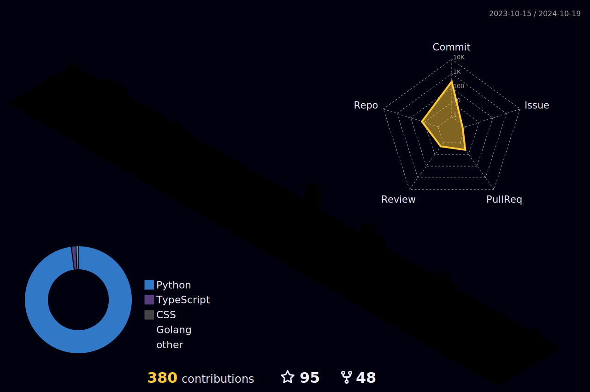

  
  

  
 |  |  |  
 | ----------- | ----------- |

 
  

   

  

 
##
   

     
  

  <picture align="center">
    <source media="(prefers-color-scheme: dark)" srcset="https://raw.githubusercontent.com/itallominatti/itallominatti/output/github-contribution-grid-snake-dark.svg">
    <source media="(prefers-color-scheme: light)" srcset="https://raw.githubusercontent.com/itallominatti/itallominatti/output/github-contribution-grid-snake-dark.svg">
    
  </picture>
  
 

 
  
  

  

